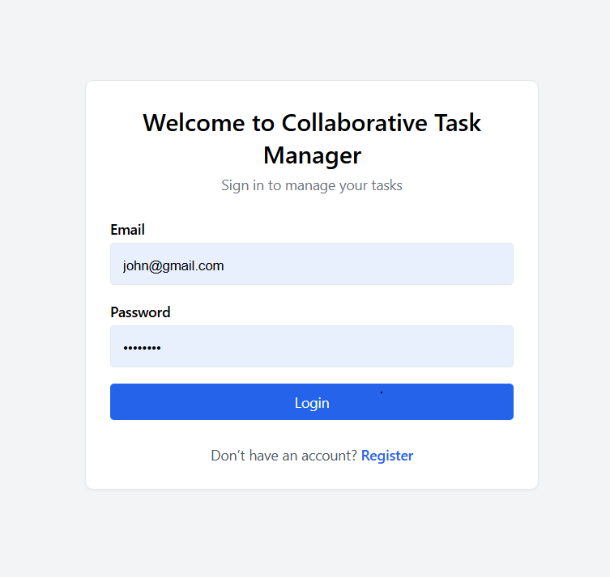
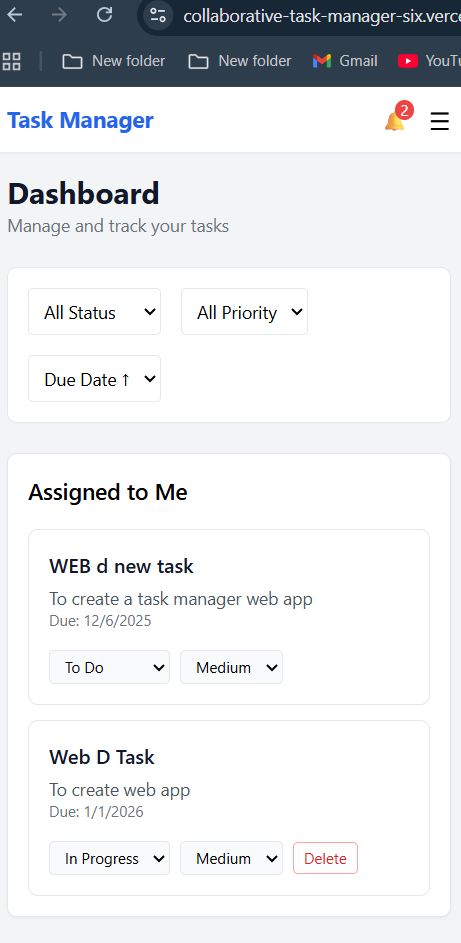
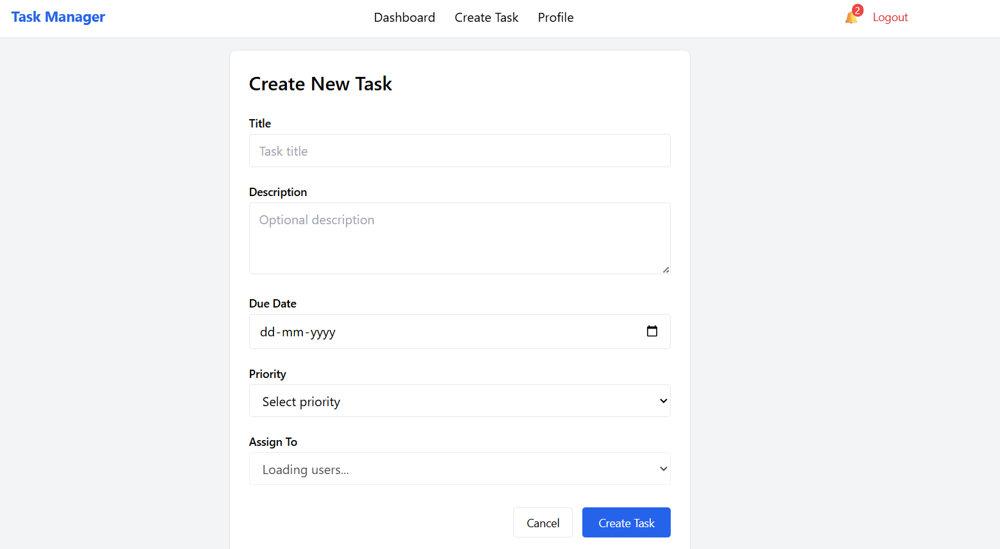
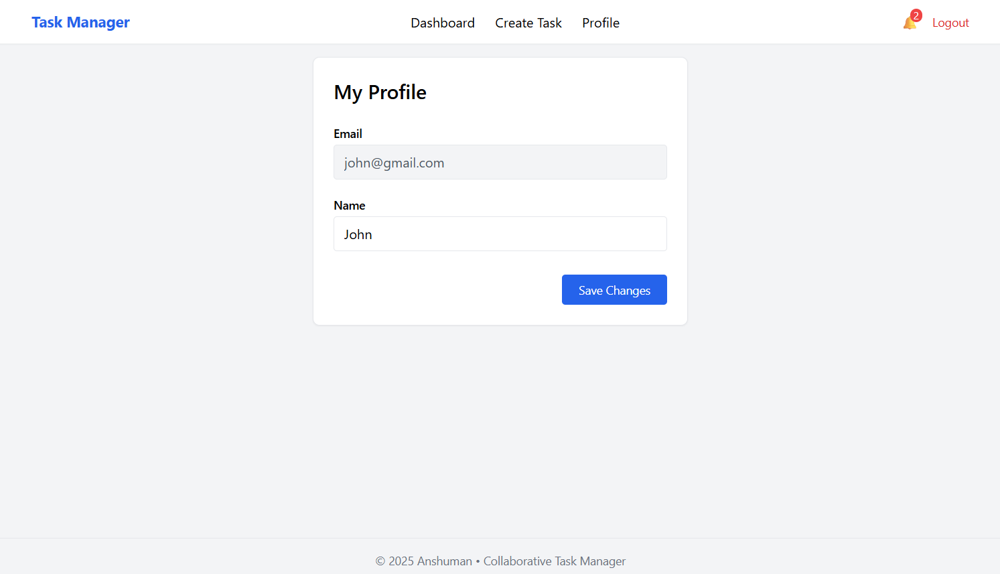

# 🧑‍💻 Collaborative Task Manager

A **production-ready full-stack collaborative task management application** built as part of a Full-Stack Engineering Assessment.  
The application supports **secure authentication, task collaboration, real-time updates, notifications, audit logging, and a responsive dashboard UI**.

---

## 🚀 Live Demo

- **Frontend**: <https://collaborative-task-manager-six.vercel.app/>
- **Backend API**: <https://collaborative-task-manager-backend-hppt.onrender.com>

---

## 🧰 Tech Stack

### Frontend
- React (Vite)
- TypeScript
- Tailwind CSS
- React Query (TanStack Query)
- React Hook Form + Zod
- Socket.io Client

### Backend
- Node.js + Express
- TypeScript
- Prisma ORM
- PostgreSQL
- JWT Authentication
- Socket.io
- Jest (Testing)

---

## 🗂️ Project Structure

collaborative-task-manager/
├── backend/
│   ├── src/
│   │   ├── auth/
│   │   ├── tasks/
│   │   ├── notifications/
│   │   ├── audit/
│   │   ├── socket.ts
│   │   ├── app.ts
│   │   └── server.ts
│   └── prisma/
└── frontend/
    └── src/
        ├── pages/
        ├── components/
        ├── hooks/
        ├── api/
        └── main.tsx

---

## 🔐 Authentication & Authorization

- User registration & login  
- Passwords hashed using bcrypt  
- JWT stored in HttpOnly cookies  
- Protected routes via middleware  
- Role-based permissions:
  - Only creators can delete tasks
  - Creators & assignees can update tasks

---

## 📋 Task Management (CRUD)

Each task contains:
- title, description, dueDate
- priority (LOW, MEDIUM, HIGH, URGENT)
- status (TODO, IN_PROGRESS, REVIEW, COMPLETED)
- creatorId & assignedToId

Supported operations:
- Create, Update, and Delete tasks
- Filter by status & priority
- Sort by due date

---

## ⚡ Real-Time Collaboration (Socket.io)

Real-time events include:
- Task assignment & Status updates
- Priority updates & Instant notification delivery
- Live dashboard synchronization (no refresh needed)
- Sockets are authenticated using JWT from cookies:
  Room: user:{userId}

---

## 🔔 Notifications System

- Persistent notifications stored in DB  
- Real-time delivery via Socket.io  
- Notification types: Task assigned, Task status changed
- Mark individual or all notifications as read
- Notification badge updates automatically

---

## 🧾 Audit Logging (Bonus)

Every important task update is logged for accountability:
- Who updated the task
- What action was taken
- When it happened (Timestamp)

Useful for:
- Debugging
- Accountability
- Enterprise-grade traceability

---

## 🧑‍💼 User Profile

- View profile details
- Update user name
- Email is read-only
- Profile data protected via auth middleware

---

## 📊 Dashboard Features

- Tasks assigned to me / Tasks created by me
- Overdue task highlighting
- Filtering by status & priority
- Sorting by due date
- Loading skeletons for better UX
- Optimistic UI updates for instant feedback

---

## 🎨 UI & UX

- Fully responsive layout
- Clean Tailwind design
- Navbar with:
  - Notifications
  - Profile link
  - Create Task
  - Logout
- Footer with author information
- Smooth loading and error states

---

## 🧪 Testing

Backend tests implemented using Jest:
- Task creation validation
- Authorization checks
- Audit logging verification

Command: cd backend && npm test

---

## 🔌 API Endpoints

Auth:
- POST /api/auth/register
- POST /api/auth/login
- POST /api/auth/logout

Tasks:
- GET /api/tasks
- POST /api/tasks
- PUT /api/tasks/:id
- DELETE /api/tasks/:id

Notifications:
- GET /api/notifications
- PATCH /api/notifications/:id/read
- PATCH /api/notifications/read-all

---

## 🛠️ Local Setup

Backend:
1. cd backend
2. npm install
3. npx prisma migrate dev
4. npm run dev

Frontend:
1. cd frontend
2. npm install
3. npm run dev

---

### Production Configuration Notes

- Frontend is deployed on Vercel.
- Backend is deployed on Render.
- PostgreSQL is hosted on Railway.

Important production settings:
- JWT is stored in HttpOnly cookies.
- Cookies use `secure=true` and `sameSite=none` for cross-domain auth.
- Vercel rewrites `/api/*` requests to the backend service.

---

## 🖼️ Screenshots

### Login Page

### Dashboard

### Create Task

### Profile Page

---

## ⚠️ Trade-offs & Assumptions

- No email notifications (in-app only)
- Simple role model (creator vs assignee)
- Minimal animations to keep performance optimal

---

## Debug Notes / Fixes

- Fixed JWT payload mismatch between auth service and auth middleware that caused `creatorId` to be undefined in production.
- Ensured cookies work correctly in production using `sameSite="none"` and `secure=true`.
- Added SPA rewrite rules for Vercel to prevent 404s on page refresh.

## ✅ Final Notes

- Clean architecture (Controller → Service → Repository)
- Strong TypeScript typing
- DTO validation using Zod
- Modern frontend data handling

---

## 👤 Author

Anshuman Tiwari
Full-Stack Developer
